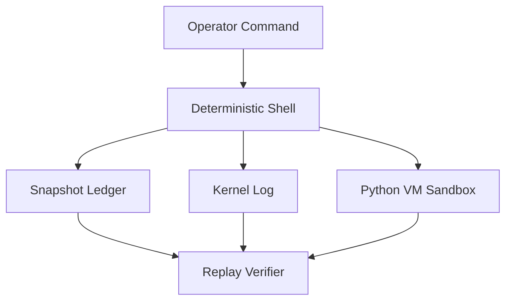

# PIYXU Deterministic Shell Technical Guide

The PIYXU deterministic shell exposes the audited interface that operators use
to complete every roadmap task. Each command interacts with the snapshot ledger
and kernel log so contributors can replay the full system history. Consult the
[OS2 Shell Command Reference](./os2_shell_command_reference.md) for a
capability-by-capability breakdown of every built-in command, including usage
flags and auditing behaviors.

## Architectural Overview

## Core Subsystems

- **Snapshot Ledger Integration** – Every command records a signed event. The
  ledger captures command metadata, hashed state, and readiness updates so the
  replay verifier can reconstruct execution deterministically.
- **Python VM Sandbox** – The sandbox allocates a token budget, validates
  imports, and routes stdout/stderr into the kernel log. Commands such as `pyvm`
  and `deterministic-benchmark` run entirely inside this sandbox.
- **Audit Pipelines** – Observability services (entropy audits, GPU leasing,
  module permissions, backup management) stream JSONL transcripts to
  `rust/os2-kernel/logs/cli_sessions/` for post-run review.

## Phase 7 Administrative Commands

The following administrative commands were added to complete the Phase 7
documentation and release milestones:

| Command | Purpose |
| --- | --- |
| `publish-shell-manual` | Regenerates this guide, capturing the ledger event `documentation_published`. |
| `document-release-workflow` | Produces the deterministic release playbook for contributors. |
| `document-module-tree` | Bridges the Roken Assembly manifest set into `docs/module_tree.md`. |
| `kernel-ready-flag` | Toggles the readiness indicator recorded in `cli/data/kernel_state.json`. |

## Deterministic Operating Practices

1. Prefer scripted invocations (`python -m cli.command_shell --script ...`) so
   every roadmap task can be replayed from transcripts.
2. Execute `deterministic-benchmark run --json` before tagging a release to
   capture validation telemetry and ledger linkage.
3. Update documentation using the Phase 7 commands and commit the resulting
   markdown artifacts to preserve the signed provenance chain.
4. Export module inventories and readiness metadata as part of the release
   checklist so downstream operators can verify the state of the deterministic
   kernel without rerunning commands.
